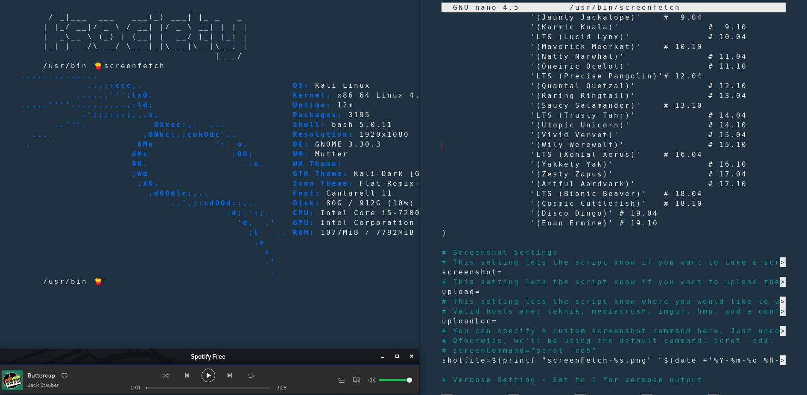

# Ricing-Linux
### This repository needs updated
## Debian Bash Terminal ricing.
How to make terminal look like this?

-## If you you're using GTK Theme here's how you will go about it 
1. In your home directory edit */.config/gtk.css*. If you don't have it, create one.
2. Add bit of padding like you do basic css. 
   Mine here is [here](https://github.com/anushang/Ricing-Linux/blob/master/gtk.css)
3. Now we have to make changes in bashrc. Bashrc is basically where you put commands here to set up the shell for use in your      particular environment, or to customize things to your preferences. 
   Here's mine [link](.bashrc)
   
